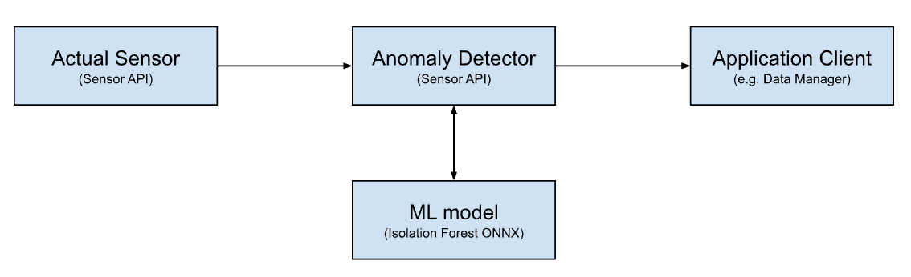

# Tabular Data `Anomaly-Detector` Module

This [module](https://docs.viam.com/registry/#modular-resources) implements the [`rdk:component:base` API](/components/base/#api) in an `anomaly-detector` model.
This repo can be used as a starter kit to implement your personal real time anomaly detection using a machine learning model trained with your data.
This is an advanced topic and Viam basics such as configuring machines, components and services are expected to be known! If you are not familiar with these topics yet, I recommend to start with this [beginner tutorial](https://docs.viam.com/how-tos/configure/) first and then come back.

## Concept

The anomaly sensor takes an "actual" sensor as dependency/input and forwards it to the isolation forest onnx model for inference. The process is triggered by a client e.g. the Viam data manager polling the anomaly detector readings api:




## Requirements

If you haven't done so, I recommend to familiarize with the topic of creating your own Viam resources. You can find the related documentation here: [Create Your Own Modules](https://docs.viam.com/registry/#create-your-own-modules).

To create your own development setup follow these steps (currently tested on `Darwin/arm64`):

1. Install `viam-server` on your machine [Install Guide](https://docs.viam.com/installation/)
2. Clone this repository to your machine or just download the [sample.onnx](model/sample.onnx) file
3. In app.viam.com navigate to the `Configuration` tab of your machine
4. Add the [ONNX module](https://app.viam.com/module/viam-labs/onnx-cpu) under add `Service` to your machine
5. Change the name to `mlmodel` in the prompt
6. In the automatically created `mlmodel` component enter the path to the previously downloaded `sample.onnx` file
7. Add a [fake sensor](https://docs.viam.com/components/sensor/fake/)
8. Add the [anomaly detector](https://app.viam.com/module/viam-soleng/anomaly-detector) module under add `Component` from the Viam registry
9. Add this configuration to the newly added `attributes` of the anomaly detector sensor:
```json
{
  "features": [
    {
      "key": "a"
    },
    {
      "key": "Hour"
    },
    {
      "key": "Week_Day"
    },
    {
      "key": "Month_Day"
    },
    {
      "key": "Month"
    },
    {
      "key": "c",
      "rolling_mean": 3
    },
    {
      "key": "c",
      "lag": 1
    }
  ],
  "sensor": "fake-sensor",
  "model": "mlmodel"
}
``` 

6. Save the configuration and start the machine


## Configure your `anomaly-detector` sensor

### Attributes

The following attributes are available:

| Name                   | Type     | Required?    | Description                                                                                                               |
| ---------------------- | -------- | ------------ | ------------------------------------------------------------------------------------------------------------------------- |
| `sensor`               | string   | **Required** | The sensor you want to apply the ml model to                                                                              |
| `model`                | string   | **Required** | The ml model to be used                                                                                                   |
| `features`             | [struct] | **Required** | List of features                                                                                                          |
| `feature.key`          | string   | **Required** | The key to the reading of your input/source sensor or one of `"Year", "Month", "Month_Day", "Week_Day", "Hour", "Minute"` |
| `feature.rolling_mean` | int      | **Optional** | Number of readings to calculate the rolling mean of this feature                                                          |
| `feature.lag`          | int      | **Optional** | Adds the reading `current-n`.                                                                                             |

> [!IMPORTANT]
> The order of features is consistent with the order used for passing them into the ML model.
> Make sure this maps to the order you have trained the model with!

### Next steps

To train your own model with your data we have created a sample training script which should be easy to tune towards your particular data set: [Model Training](training/README.md)

Let us know if you are interested in this topic, have questions, struggle with setting it up, enhancing it etc.. We are happy to help!

## Troubleshooting

N/A
